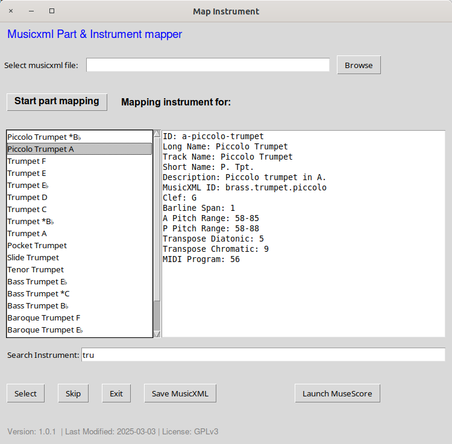

[](https://www.gnu.org/licenses/gpl-3.0.en.html)

# musicxml-part-mapper
Set correct instrument/transposition in OMR generated musicxml files (e.g. with Audiveris)



# MusicXML Part & Instrument Mapper - User Manual

## 1. Introduction

The MusicXML Part & Instrument Mapper is a tool designed to help you map instruments in MusicXML files. It allows you to:

- Load MusicXML files (both uncompressed `.musicxml` and compressed `.mxl` formats).
- Map instruments to parts in the score.
- Save the modified MusicXML file.
- Launch MuseScore to view the modified score.

---

## 2. Installation

### Prerequisites

- **Python 3.x**: Ensure Python 3.x is installed on your system.  
- **Tkinter**: This is usually included with Python.  
- **MuseScore (optional)**: If you want to launch MuseScore from the application, ensure it is installed.  

### Steps

1. Download the application files:
   - `musicxml-part-mapper.py`
   - `instruments.xml`

2. Place both files in the same directory.  
3. Install required Python packages (if any):

---

## 3. Launching the Application

### From the Command Line

1. Open a terminal or command prompt.  
2. Navigate to the directory where the application files are located.  
3. Run the application:

```bash
python musicxml-part-mapper.py
```
---

## 4. Using the Application

### Loading a MusicXML File

1. Click the **Browse** button to open a file chooser dialog.  
2. Select a MusicXML file (`.musicxml`, `.xml`, or `.mxl`).  
3. The file path will appear in the entry box, and the parts will be loaded.  

### Mapping Instruments

1. After loading a file, click **Start Part Mapping**.  
2. For each part:
   - Select an instrument from the list.
   - Click **Select** to save the mapping.
   - Click **Skip** to skip the current part and move to the next one.  
3. Repeat until all parts are processed.

### Skipping Parts

- Click the **Skip** button to skip the current part and move to the next one.

### Saving the Modified File

1. After mapping instruments, click **Save MusicXML**.  
2. Choose a location and filename to save the modified MusicXML file.  
3. The file will be saved with the updated instrument mappings.

### Launching MuseScore

1. After saving the file, click **Launch MuseScore**.  
2. MuseScore will open with the modified file loaded.

### Optional: Integrating in Audiveris

 - It might be a good idea to add this application to Audiveris plugins.xml in the Audiveris configuration folder. See Audiveris Handbook.
   e.g.
   ```xml
   <!-- Musicxml part mapper -->
    <plugin id="mxl part mapper" tip="Assign instruments">
        <arg>/path-to-the-application/musicxml-part-mapper.py</arg>
        <arg>{}</arg>
    </plugin>

   
### Optional: Integrate your Notation application (Musescore).
 - Edit these variables at the beginning of the python script. Only tested with MuseScore - but should probably also work with other applications. If EXT_APPLICATION is not definded, the button will not show.
   ```bash
     EXT_APPLICATION = "MuseScore" # if not defined => hide button to launch application
     EXT_APP_PATH =  "~/.local/bin/mscore4portable"
     LOGFILE = "part-mapper.log"
     WORK_DIRECTORY = "your-directory"  # Change this to your desired directory
  
---

## 5. Troubleshooting

### File Not Found

- Ensure that `instruments.xml` is in the same directory as the script or specify its path using the `--instruments` argument.
- Ensure that the MusicXML file exists and is accessible.

### Log File

- The application creates a log file (`part-assign.log`) in the same directory as the script. Check this file for error messages.

### MuseScore Not Found

- Ensure MuseScore is installed and the path is correctly specified in the `EXT_APP_PATH` variable.

---

## License

This application is licensed under the **GPLv3 License**. See the `LICENSE` file for details.
